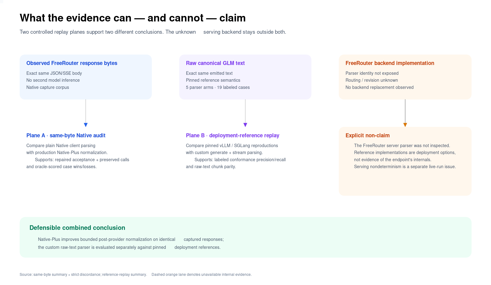
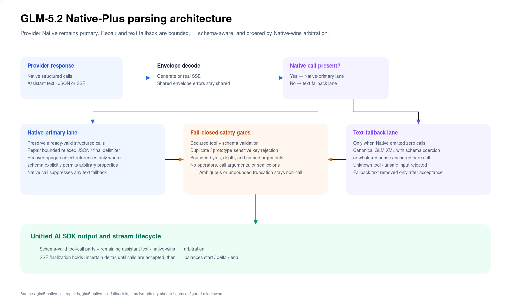
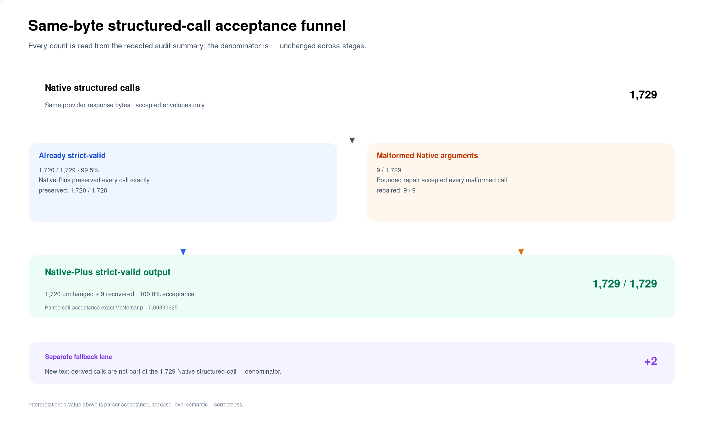
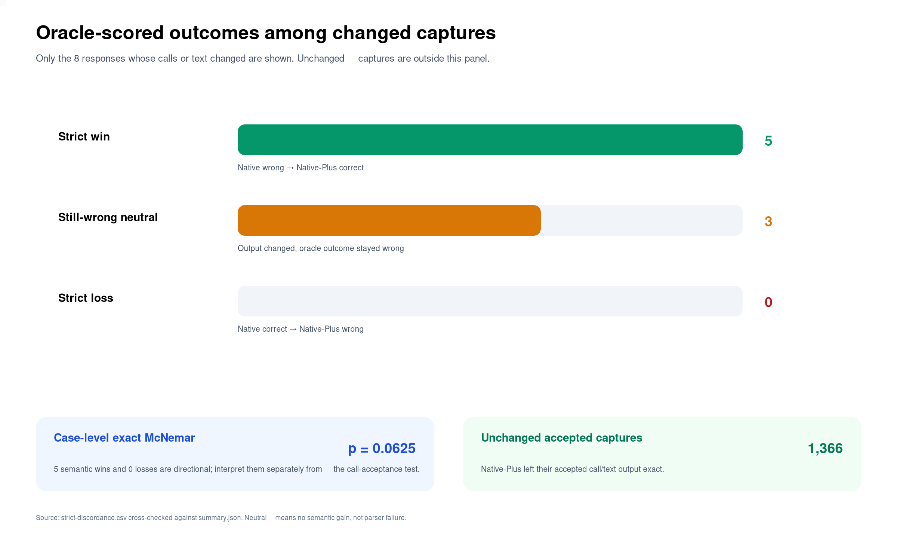
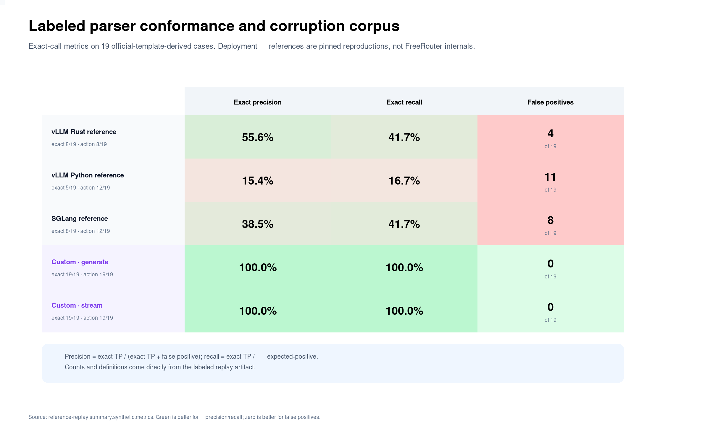
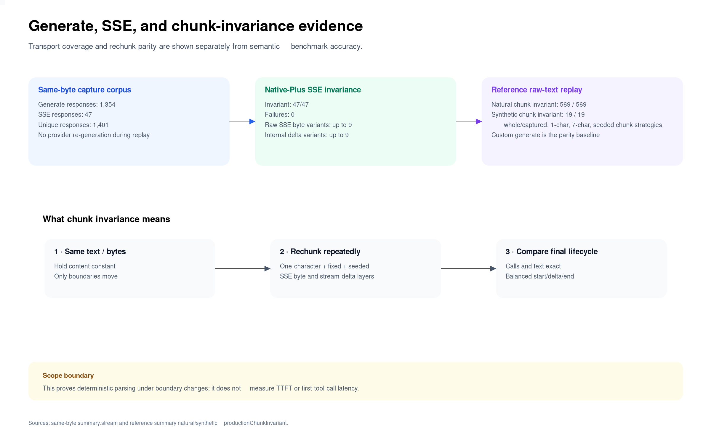

# GLM‑5.2 도구 호출 파서 우월성 검증

작성일: 2026-07-17 (Asia/Seoul)

<!-- Generated by render_parser_superiority_report.py. Numeric claims come from the linked artifacts. -->

## Executive Summary

이번 재검증은 서로 다른 질문을 두 개의 통제된 replay plane으로 분리했다. 첫째, 이미 관측된 provider 응답 바이트를 plain Native와 production Native‑Plus에 동일하게 넣어 post-provider normalization의 효과만 측정했다. 둘째, canonical GLM raw text를 pinned vLLM/SGLang deployment-reference decoder와 custom generate/stream parser에 동일하게 넣어 parser semantics를 비교했다.

1. **동일 바이트 call acceptance는 1,720/1,729에서 1,729/1,729로 개선됐다.** 기존 strict-valid 1,720개를 모두 보존하고 malformed 9개를 모두 복구했다. paired call-acceptance exact McNemar p=0.00390625다.
2. **oracle-scored changed capture는 5승·3중립·0패였다.** strict semantic case-level exact McNemar p=0.0625이므로, 방향성은 좋지만 call-acceptance 유의성과 semantic correctness 유의성을 혼동하지 않는다.
3. **SSE 47/47가 chunk-invariant였다.** 응답당 raw SSE byte 분할과 internal stream-delta 분할을 각각 최대 9개까지 바꾸어도 최종 call/text lifecycle이 같았다.
4. **Reference gate:** 라벨 corpus의 exact precision·recall·false positive·exact correct를 함께 본 사전 정의 dominance gate에서 custom generate가 모든 pinned deployment reference보다 나쁘지 않고 각 reference 대비 적어도 한 지표가 엄격히 우수했다. 따라서 **이 라벨 corpus 범위에서는 custom parser superiority gate를 통과했다.**
5. **Natural raw-capture score는 별도 경계다.** Natural canonical capture에서는 custom이 BFCL 340/456, vLLM Rust 340/456, SGLang 339/456이었고, ACE는 custom 50/100, vLLM Rust 50/100이었다. 따라서 labeled corruption corpus의 superiority를 모든 natural score의 우월성으로 확장하지 않는다.
6. **FreeRouter backend parser를 식별하거나 교체했다고 주장하지 않는다.** vLLM과 SGLang은 pinned deployment-reference reproduction이며 endpoint 내부 구현은 공개되지 않았다.



## 1. 증거 경계와 질문 분리

| Evidence plane | 고정한 것 | 바꾼 것 | 허용되는 주장 |
|---|---|---|---|
| A. Same-byte Native audit | provider JSON/SSE response body | client-side Native vs Native‑Plus parsing | 동일 응답에서 bounded normalization이 acceptance와 oracle outcome을 어떻게 바꾸는가 |
| B. Raw-text reference replay | canonical GLM text와 tool schema | pinned reference vs custom parser | 동일 text에서 parser conformance·corruption recovery가 어떻게 다른가 |
| Unknown backend | 관측 불가 | 관측 불가 | FreeRouter 내부 parser, routing, serving revision을 추론하지 않음 |

이 경계가 중요한 이유는 live arm을 두 번 호출해 얻은 점수 차이가 serving 비결정성을 포함하기 때문이다. 이전 live Native/Native‑Plus snapshot의 score 차이는 middleware intervention이 0이었던 구간을 포함하므로 parser 효과의 primary evidence로 사용하지 않는다. 이번 보고서의 parser 귀속 결론은 동일 response bytes 또는 동일 raw text replay에 한정한다.

## 2. Native‑Plus 설계



Native‑Plus는 별도 text protocol이 아니라 Native-primary normalization layer다. provider-native structured call과 history를 우선 보존하고, bounded relaxed-JSON·마지막 delimiter·명시적으로 open object인 schema의 opaque reference만 제한적으로 복구한다. Native call이 하나라도 있으면 text fallback은 억제한다. Native call이 전혀 없을 때만 canonical XML 또는 응답 전체에 anchored된 bare call을 검사한다.

Fail-closed gate는 duplicate argument, undeclared tool, prototype-sensitive key, operator, argument가 있는 call expression, semicolon을 거부한다. 증명 가능한 close-only truncation만 bounded 복구하고 ambiguous 또는 unbounded truncation은 non-call로 남긴다. stream은 확정 전 delta를 조정해 최종 tool lifecycle과 generate 결과를 맞춘다.

## 3. Same-byte Native audit

Source: [same-byte summary.json](results/2026-07-17-glm5-native-parser-same-byte-audit-v1/summary.json), [strict-discordance.csv](results/2026-07-17-glm5-native-parser-same-byte-audit-v1/strict-discordance.csv), [same-byte run-meta.json](results/2026-07-17-glm5-native-parser-same-byte-audit-v1/run-meta.json)

### 3.1 Corpus와 envelope 경계

| Metric | Result | Artifact field |
|---|---:|---|
| Unique Native responses | 1,401 | `corpus.uniqueNativeCaptures` |
| Generate / SSE | 1,354 / 47 | `corpus.generateCaptures`, `corpus.sseCaptures` |
| Shared envelope errors | 27 | `envelope.sharedEnvelopeErrors` |
| Comparable accepted envelopes | 1,374 | `envelope.accepted` |
| Provider calls during replay | 0 | `run-meta.providerCalls` |
| Raw request material written | false | `run-meta.rawRequestMaterialWritten` |

shared envelope error는 두 parser가 함께 받지 못한 transport/envelope 문제이므로 parser 귀속 분모에서 분리했다. same-byte audit는 새 model inference를 수행하지 않았다.

### 3.2 Call acceptance



| Stage | Calls | Rate |
|---|---:|---:|
| Native structured calls | 1,729 | 100% |
| Native strict-valid | 1,720 | 99.48% |
| Valid Native calls preserved | 1,720/1,720 | 100% |
| Malformed Native calls repaired | 9/9 | 100% |
| Native‑Plus strict-valid output | 1,729 | 100.00% |
| New text-fallback calls | +2 | structured-call denominator 밖 |

Call-level paired acceptance의 discordance는 repair 9, loss 0이므로 exact McNemar p=0.00390625다. 이것은 parser가 schema-valid call로 수용했는지에 대한 통계이며, 호출 내용이 task oracle에 맞았는지에 대한 통계가 아니다.

### 3.3 Oracle-scored changed captures



전체 changed capture 8건은 strict win 5, still-wrong neutral 3, loss 0로 정확히 분할된다. win case는 다음과 같다.

- `ace:en:normal_single_turn_parallel_function:normal_single_turn_parallel_function_52`
- `ace:zh:normal_similar_api:normal_similar_api_12`
- `ace:zh:normal_single_turn_parallel_function:normal_single_turn_parallel_function_40`
- `bfcl:-:simple_java:simple_java_45`
- `bfcl:-:simple_javascript:simple_javascript_9`

Case-level exact McNemar p=0.0625다. 따라서 “관측된 5건을 손실 없이 복구했다”는 사실은 말할 수 있지만, 이 case 표본만으로 semantic accuracy의 통계적 우월성을 5% 수준에서 확정하지 않는다.

## 4. Pinned reference parser replay

Source: [reference-replay summary.json](results/2026-07-17-glm5-reference-parser-replay-v1/summary.json)

Labeled corpus는 official chat-template grammar에서 도출한 conformance, bounded corruption, false-positive, parallel-call case 19건이다. 각 parser는 동일 text와 동일 tool schema를 받았다.



| Parser | Exact | Action correct | False positive | False negative | Exact precision | Exact recall |
|---|---:|---:|---:|---:|---:|---:|
| vLLM Rust reference | 8/19 | 8/19 | 4 | 7 | 55.56% | 41.67% |
| vLLM Python reference | 5/19 | 12/19 | 11 | 10 | 15.38% | 16.67% |
| SGLang reference | 8/19 | 12/19 | 8 | 7 | 38.46% | 41.67% |
| Custom · generate | 19/19 | 19/19 | 0 | 0 | 100.00% | 100.00% |
| Custom · stream | 19/19 | 19/19 | 0 | 0 | 100.00% | 100.00% |

`Exact`는 expected no-call을 포함한 whole-case exact이고, precision/recall의 positive denominator는 expected call case다. Harness의 false positive는 call을 수용했지만 expected calls와 exact가 아닌 row를 뜻한다.

Gate 판정: 라벨 corpus의 exact precision·recall·false positive·exact correct를 함께 본 사전 정의 dominance gate에서 custom generate가 모든 pinned deployment reference보다 나쁘지 않고 각 reference 대비 적어도 한 지표가 엄격히 우수했다. 따라서 **이 라벨 corpus 범위에서는 custom parser superiority gate를 통과했다.**

### 4.1 Natural canonical captures와 pinned scorer

Natural replay는 기존 canonical GLM BFCL/ACE capture의 raw text를 각 parser로 다시 decode하고, 원래 suite의 pinned scorer와 호환되는 row를 생성한다. 아래 accuracy는 새로운 model generation이 아니라 동일 text의 parser replay 결과다.

#### `ace-generate` — 100 cases

| Parser | Strict correct | Protocol valid | Accuracy | Pairwise vs custom generate (win/loss/tie) |
|---|---:|---:|---:|---:|
| vLLM Rust reference | 50/100 | 100/100 | 50.00% | 0/0/100 |
| vLLM Python reference | 11/100 | 100/100 | 11.00% | 0/39/61 |
| SGLang reference | 50/100 | 100/100 | 50.00% | 0/0/100 |
| Custom · generate | 50/100 | 100/100 | 50.00% | baseline |
| Custom · stream | 50/100 | 100/100 | 50.00% | 0/0/100 |

#### `bfcl-generate` — 456 cases

| Parser | Strict correct | Protocol valid | Accuracy | Pairwise vs custom generate (win/loss/tie) |
|---|---:|---:|---:|---:|
| vLLM Rust reference | 340/456 | 456/456 | 74.56% | 0/0/456 |
| vLLM Python reference | 172/456 | 456/456 | 37.72% | 0/168/288 |
| SGLang reference | 339/456 | 456/456 | 74.34% | 0/1/455 |
| Custom · generate | 340/456 | 456/456 | 74.56% | baseline |
| Custom · stream | 340/456 | 456/456 | 74.56% | 0/0/456 |

#### `bfcl-stream` — 13 cases

| Parser | Strict correct | Protocol valid | Accuracy | Pairwise vs custom generate (win/loss/tie) |
|---|---:|---:|---:|---:|
| vLLM Rust reference | 7/13 | 13/13 | 53.85% | 0/0/13 |
| vLLM Python reference | 5/13 | 13/13 | 38.46% | 0/2/11 |
| SGLang reference | 7/13 | 13/13 | 53.85% | 0/0/13 |
| Custom · generate | 7/13 | 13/13 | 53.85% | baseline |
| Custom · stream | 7/13 | 13/13 | 53.85% | 0/0/13 |

Pairwise 열은 해당 parser 관점의 win/loss/tie이며 baseline은 custom `productionGenerate`다. 이 결과도 FreeRouter backend parser를 식별하지 않는다.

### 4.2 Reference source pins

| Reference | Implementation | Revision | Source SHA-256 |
|---|---|---|---|
| sglang | `sglang-glm47-moe-deployment-reference` | `619609aa5a2c4859cee79e9dd16a15cf1ff4c98a` | `4ed06f8370249f6dafd91b5a25796851845a028a3ccc79efff2f68b6971a5af1` |
| vllm | `vllm-rust-glm47-moe-deployment-reference` | `26c909ed74a6298952d0c3191fbfdf2b513d9e1d` | `c6ad055e23f0aaf976e1de105e6d3a152c6c04673926adb47577c5c8bf0d0147`<br>`9792c1654ff17cba55897f805bc816a00aa13b89cbcc2c17f1fd02c1301f6ae8` |
| vllm-python | `vllm-python-glm47-moe-deployment-reference` | `26c909ed74a6298952d0c3191fbfdf2b513d9e1d` | `ce3629319e56e882d25cb75d62e3e7088a4eec1518885fc69fc696eafb4a97b2` |

> Artifact caveat: vLLM and SGLang are pinned deployment-reference reproductions; this does not identify the FreeRouter backend parser.

## 5. Generate/SSE parity와 chunk invariance



| Scope | Result |
|---|---:|
| Same-byte generate captures | 1,354 |
| Same-byte real SSE captures | 47 |
| Native‑Plus SSE chunk invariant | 47/47 |
| Raw SSE byte / stream-delta max variants | 9 / 9 |
| Natural raw-text custom chunk invariant | 569/569 |
| Synthetic custom chunk invariant | 19/19 |

Chunk invariance는 content를 고정하고 boundary만 바꿨을 때 최종 calls, text, tool-call lifecycle이 exact인지 본다. TTFT, first tool-call latency, partial-call responsiveness를 측정한 것이 아니다.

## 6. 통계 해석

두 p-value는 질문과 분모가 다르다.

| Test | Unit | Discordance가 뜻하는 것 | p | 해석 |
|---|---|---|---:|---|
| Call acceptance McNemar | Native structured call 1,729개 | malformed→valid vs valid→malformed | 0.00390625 | parser acceptance 개선 근거 |
| Strict semantic McNemar | scorer-comparable case | wrong→correct vs correct→wrong | 0.0625 | 방향성은 positive, 0.05 미만 아님 |

Labeled reference corpus의 precision/recall은 설계된 corruption/conformance panel의 descriptive metric이다. corpus가 real-world corruption prevalence를 추정하지 않으므로 이를 production incidence rate로 변환하지 않는다.

## 7. 보안·재현성

- Same-byte replay provider call: `0`.
- Reference replay provider call: `0`.
- Raw request material written: `false`.
- 시각화와 보고서 생성기는 provider/network call을 하지 않는다.
- PNG converter child process에는 secret-like 이름의 환경 변수를 전달하지 않는다.
- 결과 manifest는 source SHA-256, JSON pointer, SVG/PNG SHA-256을 보존한다.

재생성 명령:

```bash
python3 benchmarks/glm-5.2-tool-calling/render_parser_superiority_report.py
```

Reference artifact가 없으면 기본 명령은 실패한다. layout 개발에서만 output과 report를 `/tmp`로 지정하고 `--allow-pending-reference`를 사용할 수 있다.

## 8. 제한사항

- Same-byte corpus는 한 endpoint와 한 날짜에 이미 관측된 response 분포다. 미래 malformed-call 발생률을 추정하지 않는다.
- BFCL·ACE natural replay는 기존 custom/adapted panel의 pinned scorer를 사용하며 공식 leaderboard submission이 아니다.
- Synthetic reference corpus는 parser semantics를 분리하기 위한 labeled panel이다. 모델의 tool selection, planning, multi-turn execution 능력을 측정하지 않는다.
- FreeRouter backend parser, routing, quantization, serving revision은 관측하지 못했다.
- Case-level semantic p-value와 call-level acceptance p-value를 서로 대체하지 않는다.
- 이전 live paired score 차이는 response bytes가 동일하지 않은 serving 반복이므로 이번 parser causal claim에 합치지 않는다.

## 9. 운영 권고

1. Provider Native를 기본 경로로 유지한다.
2. Native‑Plus는 request를 바꾸지 않는 repair-only safety layer로 사용한다.
3. Call acceptance 개선은 production gate로 활용하되, semantic benchmark 개선으로 과장하지 않는다.
4. 동일 response-byte regression corpus와 SSE rechunk suite를 CI에 유지한다.
5. Deployment-reference 결과는 text-only deployment 선택에 사용하되 FreeRouter 내부 구현의 대리 지표로 사용하지 않는다.

## 10. 산출물과 source map

- Same-byte summary: [same-byte summary.json](results/2026-07-17-glm5-native-parser-same-byte-audit-v1/summary.json)
- Changed-capture detail: [strict-discordance.csv](results/2026-07-17-glm5-native-parser-same-byte-audit-v1/strict-discordance.csv)
- Same-byte run metadata: [same-byte run-meta.json](results/2026-07-17-glm5-native-parser-same-byte-audit-v1/run-meta.json)
- Reference replay summary: [reference-replay summary.json](results/2026-07-17-glm5-reference-parser-replay-v1/summary.json)
- Visual/report manifest: [visual-manifest.json](results/2026-07-17-glm5-parser-superiority-report-v1/visual-manifest.json)

모든 보고 수치의 machine-readable source field와 artifact SHA-256은 manifest에 기록한다. PNG와 SVG는 같은 source snapshot에서 한 번에 생성한다.
