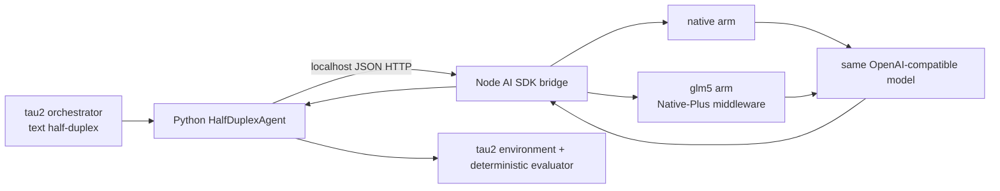

# tau2 text half-duplex × GLM-5.2 Native-Plus

> **사용 중지 (2026-07-19):** 이 tau2 어댑터는 제거된 Native‑Plus 경로용
> 역사 자료다. 현재 브리지는 해당 alias를 거부하며, prompt-only GLM용으로
> 별도 fresh harness를 작성하기 전에는 실행하지 않는다.

이 디렉터리는 tau2의 agent-under-test 호출을 LiteLLM에서 분리해, 이 저장소의 AI SDK 미들웨어를 실제로 통과시키는 localhost 연동이다. 비교 arm은 다음 두 개로 고정된다.

| tau2 agent | bridge arm | provider 요청 경로 |
|---|---|---|
| `ai_sdk_native` | `native` | OpenAI-compatible model 그대로 |
| `ai_sdk_glm5` | `glm5` | 같은 model을 `glm5NativePlusToolMiddleware`로 wrap |



## 고정된 계약

- bridge는 `127.0.0.1`, `::1`, `localhost` 외 bind/client를 거부한다.
- model ID는 bridge 시작 시 고정되며 요청이 다른 model을 지정하면 거부한다.
- `native`와 `glm5`는 model ID, prompt, tool schema, `toolChoice=auto`, `temperature=0`, `maxOutputTokens`가 같다. `glm5`에만 parser callback을 담는 내부 `providerOptions`와 Native-Plus middleware가 추가된다.
- Python adapter는 `tau2.utils.llm_utils.generate`를 import하거나 호출하지 않는다. agent-under-test의 유일한 model 경로는 localhost bridge다.
- `tools: []`인 text-only task도 지원한다. 이때 bridge 호출자는 AI SDK generation 옵션에서 tools를 생략하며, provider에는 tool catalog가 전달되지 않는다. 빈 catalog에서 call/result 이력이 나타나면 계속 거부한다.
- `AssistantMessage`는 text 또는 tool calls 중 하나만 가진다. `MultiToolMessage`는 하나의 병렬 tool-result turn으로 유지된다.
- bridge 응답 전체는 tau2 `AssistantMessage.raw_data`에, token usage는 `usage`에도 저장된다. 따라서 `raw_data.parserErrors`, `raw_data.usage`, arm, finish reason을 trajectory에서 사후 분석할 수 있다.
- 이 연동은 text half-duplex 전용이다. tau2 user simulator는 별도 participant이며 계속 LiteLLM을 사용한다.

## 설치

검증 기준 tau2 revision은 `a1e85084a3960281cb06997594133e8f39ea42a7`이다.

```bash
git clone https://github.com/sierra-research/tau2-bench /tmp/tau2-research
git -C /tmp/tau2-research checkout a1e85084a3960281cb06997594133e8f39ea42a7
uv sync --project /tmp/tau2-research --extra dev
pnpm install
```

## bridge 시작

저장소 루트에서 실행한다. API key는 파일이나 CLI 인자에 쓰지 않는다.

```bash
export FREEROUTER_BASE_URL='https://freerouter.minpeter.workers.dev/v1'
export FREEROUTER_API_KEY='...'
export TAU2_BRIDGE_MODEL='zai-org/glm-5.2'

node benchmarks/glm-5.2-tool-calling/tau2/run-bridge.mjs
```

다른 터미널에서 provider 호출 없이 상태만 확인할 수 있다.

```bash
curl --fail http://127.0.0.1:8787/healthz
```

선택 환경변수는 `TAU2_BRIDGE_PORT`(기본 `8787`), `TAU2_BRIDGE_TIMEOUT_MS`(기본 `120000`), `TAU2_BRIDGE_MAX_OUTPUT_TOKENS`(기본 `1024`)다. `TAU2_BRIDGE_HOST=0.0.0.0` 같은 외부 bind는 의도적으로 실패한다.

## prespecified complexity-stratified 20-task pilot

[`pilot-manifest.json`](./pilot-manifest.json)은 pinned base split 375개에서 domain마다 5개를 뽑은 repository-defined pilot이다. complexity score는 manifest에 적힌 7개 enumerated criterion 길이의 합이고, score 0은 제외한 뒤 `(score, task id)` 순서에서 0/25/50/75/100% 위치를 선택한다. 공식 tau2 split 또는 leaderboard submission은 아니다.

실행 전에 manifest를 현재 tau2 checkout으로 재계산한다. validator는 commit, base count `50 + 114 + 114 + 97 = 375`, membership, score, quantile 위치와 최종 ID를 모두 확인하고 하나라도 다르면 실패한다.

```bash
export REPO='/home/minpeter/github.com/minpeter/ai-sdk-tool-call-middleware'
export TAU2_ROOT='/tmp/tau2-research'
export UV_CACHE_DIR='/tmp/uv-cache'

uv run --project "$TAU2_ROOT" --extra dev python \
  "$REPO/benchmarks/glm-5.2-tool-calling/tau2/validate_pilot_manifest.py"
```

user simulator와 retail NL-assertion judge도 두 arm 사이에 고정한다. tau2 pin은 judge model을 CLI로 노출하지 않고 evaluator module에 import-time constant로 보관하므로, `tau2_cli.py`는 `TAU2_NL_JUDGE_MODEL`과 JSON object인 `TAU2_NL_JUDGE_ARGS`를 `tau2.config` 및 evaluator module 양쪽에 적용한다. API key는 args JSON에 넣지 않는다.

```bash
export PILOT_MANIFEST="$REPO/benchmarks/glm-5.2-tool-calling/tau2/pilot-manifest.json"
export PYTHONPATH="$REPO/benchmarks/glm-5.2-tool-calling/tau2"
export OPENAI_API_KEY="$FREEROUTER_API_KEY"
export OPENAI_API_BASE="$FREEROUTER_BASE_URL"
export TAU2_NL_JUDGE_MODEL='openai/zai-org/glm-5.2'
export TAU2_NL_JUDGE_ARGS='{"temperature":0,"seed":52,"response_format":{"type":"json_object"}}'

run_pilot_domain_arm() {
  domain="$1"
  arm="$2"
  mapfile -t task_ids < <(
    python - "$PILOT_MANIFEST" "$domain" <<'PY'
import json
import sys

manifest = json.load(open(sys.argv[1], encoding="utf-8"))
for task in manifest["domains"][sys.argv[2]]:
    print(task["id"])
PY
  )

  domain_args=()
  if [[ "$domain" == 'banking_knowledge' ]]; then
    domain_args=(--retrieval-config golden_retrieval)
  fi

  uv run --project "$TAU2_ROOT" python \
    "$REPO/benchmarks/glm-5.2-tool-calling/tau2/tau2_cli.py" run \
    --domain "$domain" \
    --task-set-name "$domain" \
    --task-split-name base \
    --task-ids "${task_ids[@]}" \
    --num-trials 3 \
    --agent "ai_sdk_${arm}" \
    --agent-llm 'zai-org/glm-5.2' \
    --agent-llm-args '{"bridge_url":"http://127.0.0.1:8787","timeout_seconds":125}' \
    --user user_simulator \
    --user-llm 'openai/zai-org/glm-5.2' \
    --user-llm-args '{"temperature":0,"seed":52}' \
    --seed 52 \
    --max-concurrency 1 \
    --max-retries 0 \
    --enforce-communication-protocol \
    --verbose-logs \
    --llm-log-mode all \
    --save-to "glm52-tau2-pilot-${domain}-${arm}" \
    "${domain_args[@]}"
}

for domain in airline retail telecom banking_knowledge; do
  run_pilot_domain_arm "$domain" native
  run_pilot_domain_arm "$domain" glm5
done
```

banking은 manifest에 고정된 `golden_retrieval`을 사용한다. 이는 task-specific document를 쓰는 offline 설정이며 agent retrieval tool이 없을 수 있으므로 위의 `tools: []` 경로를 지난다. 설정을 arm별로 바꾸면 안 된다.

pilot은 20 tasks × 2 arms × 3 trials = **120 agent trajectories**다. user simulator 호출과 retail NL judge 호출은 이 숫자 밖의 추가 호출이다. `--verbose-logs --llm-log-mode all`과 trajectory의 user `raw_data`, NL assertion 결과를 보존해 simulator/judge drift를 감사한다. 동일 task ID, tau2 seed, user model/args, judge model/args를 pairing key로 사용한다. provider가 `seed`를 무시해 생기는 잔여 변동은 3 trials의 pass^k/stability로 드러내며 숨기지 않는다.

## telecom first-20 smoke (stratified pilot 아님)

아래 명령은 연동 상태를 빠르게 확인하는 smoke run이다. prespecified complexity-stratified 20-task pilot으로 해석하면 안 된다. telecom base의 앞 20개 task를 두 arm에 동일하게 사용하며, 이 task들의 reward basis는 `ENV_ASSERTION` 또는 `ENV_ASSERTION + ACTION`이라 NL-assertion LLM judge를 부르지 않는다. `--auto-review`도 사용하지 않는다. 같은 tau2 seed, user model, user arguments를 쓰고 동시성과 retry를 제거해 외생적인 user-simulator 변동을 최소화한다.

```bash
export REPO='/home/minpeter/github.com/minpeter/ai-sdk-tool-call-middleware'
export TAU2_ROOT='/tmp/tau2-research'
export PYTHONPATH="$REPO/benchmarks/glm-5.2-tool-calling/tau2"

# LiteLLM 기반 user simulator만 이 두 변수를 사용한다. agent-under-test는
# 위에서 실행한 localhost bridge를 사용한다.
export OPENAI_API_KEY="$FREEROUTER_API_KEY"
export OPENAI_API_BASE="$FREEROUTER_BASE_URL"

run_arm() {
  arm="$1"
  uv run --project "$TAU2_ROOT" python \
    "$REPO/benchmarks/glm-5.2-tool-calling/tau2/tau2_cli.py" run \
    --domain telecom \
    --task-set-name telecom \
    --task-split-name base \
    --num-tasks 20 \
    --num-trials 1 \
    --agent "ai_sdk_${arm}" \
    --agent-llm 'zai-org/glm-5.2' \
    --agent-llm-args '{"bridge_url":"http://127.0.0.1:8787","timeout_seconds":125}' \
    --user user_simulator \
    --user-llm 'openai/zai-org/glm-5.2' \
    --user-llm-args '{"temperature":0,"seed":52}' \
    --seed 52 \
    --max-concurrency 1 \
    --max-retries 0 \
    --enforce-communication-protocol \
    --save-to "glm52-tau2-smoke-${arm}"
}

run_arm native
run_arm glm5
```

tau2 orchestrator가 같은 run seed를 user participant에 주입하므로 provider가 `seed`를 준수하면 두 arm은 common-random-numbers 조건이 된다. 단, arm의 응답이 달라져 user의 다음 발화가 달라지는 것은 처치에 의해 유도된 정상적인 trajectory 차이다. 사용 중인 provider가 `seed`를 무시한다면 stock tau2 user simulator로는 "user stochasticity가 정확히 0"이라고 주장할 수 없으므로, 그 경우 동일 설정 반복 trial과 user-message 원문을 함께 보고해야 한다.

두 결과의 비교 전에는 최소한 아래를 확인한다.

1. 두 `results.json`의 task ID와 per-task seed 집합이 같다.
2. `info`의 user model/args, task split, tau2 commit이 같다.
3. 자동 review가 없고 reward basis에 `NL_ASSERTION`이 없다.
4. assistant `raw_data.model`, `raw_data.arm`, `raw_data.usage`가 존재한다.
5. `glm5`의 `raw_data.parserErrors`를 intervention log로 집계하고 `native`와 분리한다.

## 로컬 검증

provider 네트워크 없이 mock model/localhost server만 사용한다.

```bash
pnpm exec vitest run \
  benchmarks/glm-5.2-tool-calling/src/tau2-bridge.test.ts

PYTHONPATH="$PWD/benchmarks/glm-5.2-tool-calling/tau2" \
  UV_CACHE_DIR=/tmp/uv-cache \
  uv run --project /tmp/tau2-research --extra dev pytest -q -rs \
  "$PWD/benchmarks/glm-5.2-tool-calling/tau2/test_tau2_native_plus_agent.py"

pnpm exec tsc -p benchmarks/glm-5.2-tool-calling/tsconfig.json --pretty false

TAU2_ROOT=/tmp/tau2-research UV_CACHE_DIR=/tmp/uv-cache \
  uv run --project /tmp/tau2-research --extra dev python \
  benchmarks/glm-5.2-tool-calling/tau2/validate_pilot_manifest.py
```

항상 실행되는 Node in-process test가 native tool call 보존, canonical GLM text fallback 복구, 두 arm의 underlying model 입력 공정성을 검증한다. Python in-process test는 실제 tau2 message class로 user → tool call → tool result → text 변환과 `raw_data` 보존을 검증한다. 실제 TCP localhost round trip은 양쪽 모두 별도 integration test다. 실행 sandbox가 loopback bind를 `EPERM`/`EACCES`로 차단하면 이 test만 명시적으로 skip되며 core test 성공으로 TCP 성공을 가장하지 않는다.
